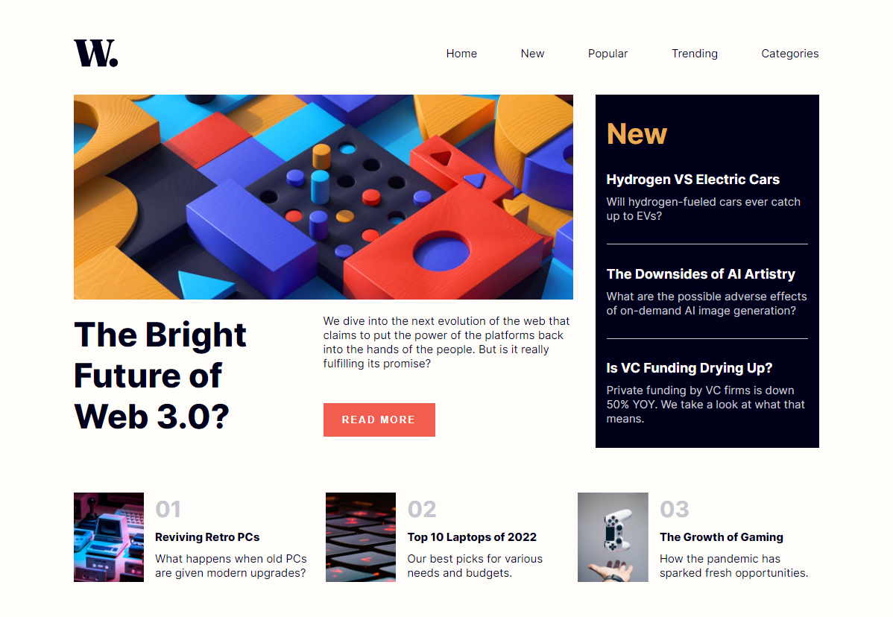

# Frontend Mentor - News homepage solution

This is a solution to the [News homepage challenge on Frontend Mentor](https://www.frontendmentor.io/challenges/news-homepage-H6SWTa1MFl). Frontend Mentor challenges help you improve your coding skills by building realistic projects.

## Table of contents

- [Overview](#overview)
  - [The challenge](#the-challenge)
  - [Screenshot](#screenshot)
  - [Links](#links)
- [My process](#my-process)
  - [Built with](#built-with)
  - [What I learned](#what-i-learned)
  - [Useful resources](#useful-resources)
- [Author](#author)

## Overview

### The challenge

Users should be able to:

- View the optimal layout for the interface depending on their device's screen size
- See hover and focus states for all interactive elements on the page

### Screenshot

### Links

- Github URL: [Github URL](https://github.com/exchyphen/fm_news-homepage)
- Live Site URL: [live site hosted by Github Pages](https://exchyphen.github.io/fm_news-homepage/)

## My process

### Built with

- HTML
- CSS
- JavaScript
- React

### What I learned

Lots of practice on HTML/CSS, especially with positioning.
Good practice on creating a simple navbar.
New experience of creating a pop up navigation menu, dimming the background (on mobile format).

### Useful resources

- [Refresher on useEffect in React](https://react.dev/reference/react/useEffect) - wanted to use this to trigger things like the hero image from desktop to mobile instead of using a media query in CSS.

## Author

- Github - [exchyphen](https://github.com/exchyphen)
- Frontend Mentor - [@exchyphen](https://www.frontendmentor.io/profile/exchyphen)
